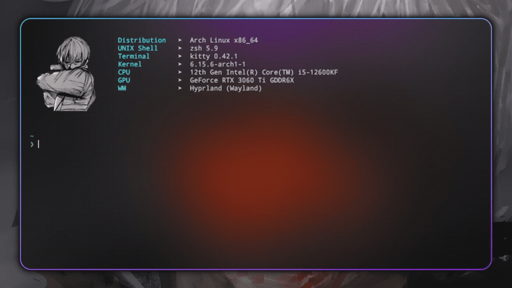
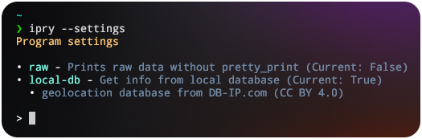
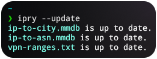

Stylish and lightweight command-line tool for inspecting IP addresses with optional **local databases** powered by [DB-IP](https://db-ip.com). Built in pure **Python**.

---

## 🚀 Features

- 🌍 IP lookup with optional City & ASN info
- 🧾 Raw or pretty-printed output
- ⚙️ Local DB support (DB-IP Free Lite)
- 💡 Easy settings toggle via CLI
- ✅ Works cross-platform (Linux / Windows / MacOS)

---

## 📦 Installation

`ipry` requires **Python 3.10+** to run. Recommended installation via [`pipx`](https://pypa.github.io/pipx/).

### 🪟 Windows

```bash
pip install ipry
```

Or optionally via pipx:
```bash
pipx install ipry
```


### 🐧 Linux

```bash
pipx install ipry
```

If pipx is not installed:
```bash
sudo pacman -S python-pipx         # Arch-based
sudo apt install pipx              # Debian/Ubuntu
sudo dnf install pipx              # Fedora
apk add py3-pipx                   # Alpine Linux
sudo xbps-install -S python3-pipx  # Void Linux
nix-env -iA nixpkgs.pipx           # NixOS
sudo zypper install pipx           # OpenSUSE
```


### 🍎 macOS

```bash
pipx install ipry
```

If pipx is not installed:
```bash
brew install pipx && pipx ensurepath
```

By default, `ipry` uses [ip-api.com](https://ip-api.com) to fetch public IP geolocation data.

---

## 🧪 Usage

Lookup any IP:
```bash
ipry 8.8.8.8
```

Raw output (compact JSON):
```bash
ipry 8.8.8.8 --raw
```

Change settings:
```bash
ipry --settings
```

Update all databases:
```bash
ipry --update
```

Show help:
```bash
ipry --help
```

---

### 🔧 Available Flags

| Flag         | Description                                                               |
| ------------ | ------------------------------------------------------------------------- |
| `--raw`      | Outputs plain JSON (no colors or formatting)                              |
| `--local-db` | Use local geolocation database (from DB-IP.com, licensed under CC BY 4.0) |
| `--settings` | Open interactive settings menu                                            |
| `--update`   | Force update of all local DB files                                        |
| `--help`     | Show help message                                                         |

---

## ⚙️ Settings Menu

Launch with:
```bash
ipry --settings
```



### Options:

- `raw` - outputs clean JSON without formatting or color
- `local-db` - uses local DB-IP datasets (City + ASN)
- `Ctrl+C` or `exit` - closes the settings menu

---

## 🌐 Local DB Mode (Optional)

When `local-db` is enabled, `ipry` will download and use local geolocation datasets from [DB-IP.com](https://db-ip.com):

- 📍 [IP-to-City Lite](https://db-ip.com/db/download/ip-to-city-lite)
- 🛰️ [IP-to-ASN Lite](https://db-ip.com/db/download/ip-to-asn-lite)

These files are free for personal and open-source use under the  
[Creative Commons Attribution 4.0 License (CC BY 4.0)](https://creativecommons.org/licenses/by/4.0/).



---

## 🛡️ VPN Detection

VPN detection uses a lightweight list from  
👉 [josephrocca/is-vpn](https://github.com/josephrocca/is-vpn)

> Special thanks to [@josephrocca](https://github.com/josephrocca)  
> for maintaining the repo and unknowingly helping this project.

---

## ❓ Why IPry?

- 🛠️ No API keys, no accounts - just works
- 🌐 Optional offline mode (local DBs from DB-IP)
- ⚡ Lightweight Python tool (~150ms per query on Linux)

---

## 🙌 Thanks

- [DB-IP.com](https://db-ip.com) - for providing free IP datasets
- [Joseph Rocca](https://github.com/josephrocca) - for VPN IP range data
- [pipx](https://github.com/pypa/pipx) – for making Python CLI tools simple to install and manage

---

## 🤝 Contributing

Pull requests and issues are welcome!  
Check out [issues](https://github.com/fabfawufawd/ipry/issues) or open a PR.